# Task 3：CIFAR-10 CNN 正式训练与调参实验报告

姓名：_____代星竹_____  
学号：_____241870210_____  
日期：2026-09-16

## 1. 实验环境与任务说明

本实验使用纯 NumPy 实现的 CNN，在 CIFAR-10 数据集上完成图像分类。训练脚本为
`train_cifar10.py`，默认使用两层卷积 block、Adam 优化器和减均值预处理。
训练过程中每 10 个 minibatch 打印一次当前 batch loss，便于确认训练过程正常进行。

实验开始前先运行 1 个 epoch 验证完整流程，实际命令为：

```bash
uv run python train_cifar10.py --epochs 1 --out-dir outputs/smock
```

正式实验应为每组实验指定不同的 `--out-dir`，避免曲线和预测文件互相覆盖。

说明：README 中的"三组对照实验"指三类对比因素，不是要求每个配置重复运行
3 次。本文使用固定的 `--seed 0` 进行对比；除非特别说明，下面每个配置运行
1 次即可。三类对比因素分别为优化器、网络深度/宽度和输入预处理。

### 1.1 实验环境迁移说明

前期流程验证和基线实验在 Ubuntu 虚拟机中完成；第 3 节及之后的所有对照实验
均在 Windows 宿主机上完成。由于本项目使用纯 NumPy 实现，训练过程不使用 GPU
加速，迁移到宿主机后主要使用宿主机的 CPU 和内存资源。与虚拟机相比，宿主机
整体运行更流畅、卡顿更少；迁移前已经得到的 Ubuntu 实验数据保留不变。除非
另有说明，本文后续实验均指 Windows 宿主机上的运行结果。

不同平台的训练时间仅用于记录实际耗时。由于运行环境、CPU、内存、线程数和
数据加载方式不同，不能仅根据训练时间直接比较平台性能。

### 1.2 流程验证

**命令**：

```bash
uv run python train_cifar10.py --epochs 1 --out-dir outputs/smock
```

由于未显式指定其他参数，本次实际配置为：Adam，学习率 `1e-3`，`num_blocks=2`，
`base_filters=32`，batch size `128`，验证集大小 `5000`，随机种子 `0`，减均值预处理。

**结果**：

| epoch | train loss | val loss | train acc | val acc |
|---:|---:|---:|---:|---:|
| 1 | 1.1642 | 1.1719 | 59.78% | 58.82% |

训练耗时约 **1225.41 秒（20.42 分钟）**。测试集结果为 loss `1.1997`，
accuracy **58.13%**。

逐类测试准确率如下：

| class | accuracy |
|---|---:|
| airplane | 62.80% |
| automobile | 84.80% |
| bird | 46.30% |
| cat | 34.40% |
| deer | 34.60% |
| dog | 52.00% |
| frog | 67.50% |
| horse | 72.00% |
| ship | 71.80% |
| truck | 55.10% |

**曲线**：

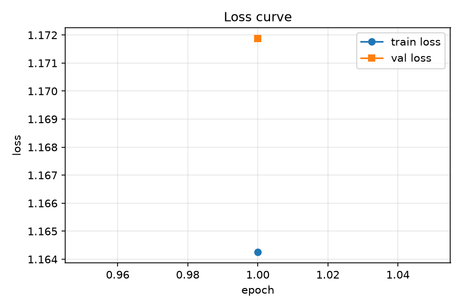
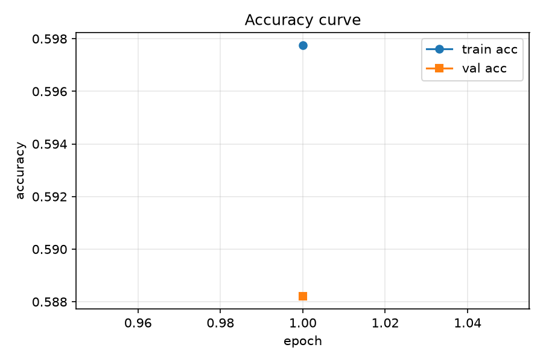

**分析和结论**：该结果用于确认流程正确，不作为最终三组对照实验结论。1 个 epoch
即可达到约 58% 的测试准确率（随机猜测为 10%），说明模型实现正确、训练流程正常。
在逐类准确率中，`automobile`（84.80%）和 `horse`（72.00%）表现较好，`cat`
（34.40%）和 `deer`（34.60%）表现较差，这一趋势在后续正式实验中持续出现。

流程验证产物：
- `outputs/smock/test_predictions.npz`
- `outputs/smock/samples.npz`

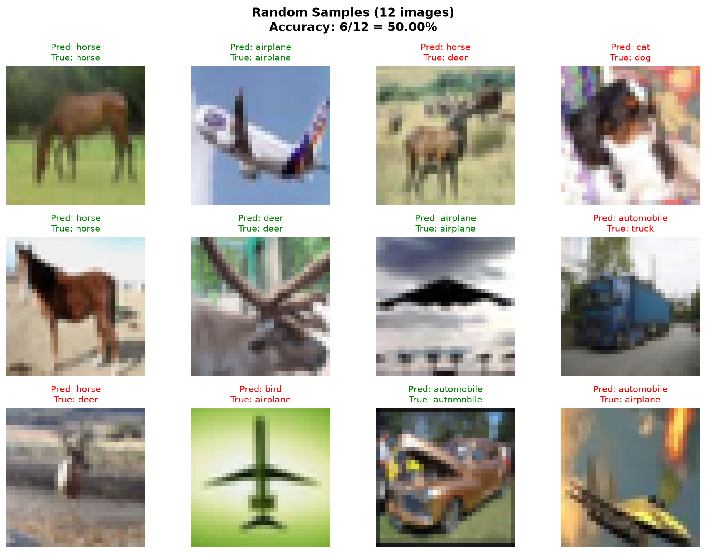

## 2. 基线实验

### 2.1 命令

```powershell
uv run python train_cifar10.py --epochs 5 --optimizer adam --lr 1e-3 --num-blocks 2 --base-filters 32 --batch-size 128 --num-val 5000 --seed 0 --out-dir outputs/baseline_adam
```

### 2.2 结果

| epoch | train loss | val loss | train acc | val acc |
|---:|---:|---:|---:|---:|
| 1 | 1.1642 | 1.1719 | 59.78% | 58.82% |
| 2 | 0.9731 | 1.0226 | 66.69% | 64.50% |
| 3 | 0.8597 | 0.9468 | 70.84% | 66.78% |
| 4 | 0.7931 | 0.9094 | 73.16% | 68.98% |
| 5 | 0.7394 | 0.8906 | 75.23% | 68.76% |

测试 loss：0.9166  
测试准确率：**68.69%**  
训练时间：**7111.18 秒（118.52 分钟）**

逐类测试准确率如下：

| class | accuracy |
|---|---:|
| airplane | 75.80% |
| automobile | 78.60% |
| bird | 61.00% |
| cat | 50.50% |
| deer | 51.00% |
| dog | 60.80% |
| frog | 84.60% |
| horse | 68.70% |
| ship | 77.10% |
| truck | 78.80% |

### 2.3 曲线

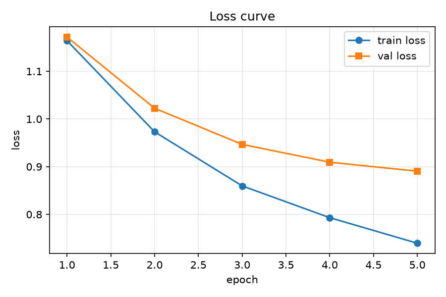
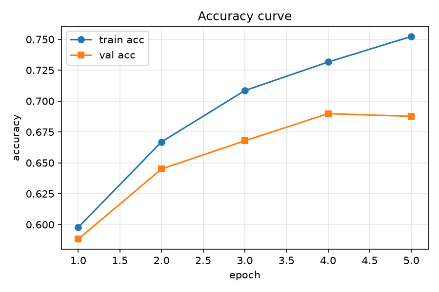

### 2.4 分析和结论

在 Adam 优化器、减均值预处理下，5 个 epoch 后测试准确率达到 68.69%。`frog` 的
识别效果最好（84.60%），`cat` 和 `deer` 相对较弱（分别为 50.50% 和 51.00%）。
训练集准确率持续上升，但验证集准确率在第 4 个 epoch 达到最高的 68.98% 后，第 5
个 epoch 小幅下降到 68.76%，说明模型已经出现轻微过拟合迹象。

该结果作为后续三组对照实验的对比基准。

## 3. 对照实验一：优化器对比

固定网络结构、预处理、batch size、epoch 数和随机种子，仅改变优化器。SGD
需要使用较大的学习率；本实验中普通 SGD 使用 `0.05`，动量 SGD 使用 `0.01`。
本组比较 `sgd`、`sgd_momentum` 和 `adam` 三种优化器各 1 次。

### 3.1 命令

```powershell
uv run python train_cifar10.py --epochs 5 --optimizer sgd --lr 0.05 --num-blocks 2 --base-filters 32 --batch-size 128 --num-val 5000 --seed 0 --out-dir outputs/opt_sgd

uv run python train_cifar10.py --epochs 5 --optimizer sgd_momentum --lr 0.01 --num-blocks 2 --base-filters 32 --batch-size 128 --num-val 5000 --seed 0 --out-dir outputs/opt_momentum

uv run python train_cifar10.py --epochs 5 --optimizer adam --lr 0.001 --num-blocks 2 --base-filters 32 --batch-size 128 --num-val 5000 --seed 0 --out-dir outputs/opt_adam
```

### 3.2 结果

#### 3.2.1 汇总对比

| optimizer | lr | final train loss | best val acc | test acc | time |
|---|---:|---:|---:|---:|---:|
| sgd | 0.05 | 1.0204 | 61.72% | 60.91% | 10318.92 s（171.98 min） |
| sgd_momentum | 0.01 | 0.8525 | 66.14% | 65.67% | 7062.52 s（117.71 min） |
| adam | 0.001 | 0.7394 | 68.76% | 68.69% | 9372.16 s（156.20 min） |

#### 3.2.2 SGD（lr=0.05）

| epoch | train loss | val loss | train acc | val acc |
|---:|---:|---:|---:|---:|
| 1 | 1.6455 | 1.6507 | 43.10% | 42.60% |
| 2 | 1.2588 | 1.2707 | 55.70% | 55.00% |
| 3 | 1.1840 | 1.2002 | 59.11% | 57.94% |
| 4 | 1.1050 | 1.1378 | 62.03% | 60.12% |
| 5 | 1.0204 | 1.0748 | 64.29% | 61.72% |

测试集 loss 为 `1.0965`，测试准确率为 **60.91%**。

逐类准确率为：

| class | accuracy |
|---|---:|
| airplane | 44.90% |
| automobile | 66.70% |
| bird | 51.50% |
| cat | 52.60% |
| deer | 44.10% |
| dog | 42.50% |
| frog | 85.00% |
| horse | 67.60% |
| ship | 88.90% |
| truck | 65.30% |

#### 3.2.3 SGD with Momentum（lr=0.01）

| epoch | train loss | val loss | train acc | val acc |
|---:|---:|---:|---:|---:|
| 1 | 1.2415 | 1.2431 | 56.71% | 55.90% |
| 2 | 1.0726 | 1.1025 | 63.18% | 61.14% |
| 3 | 0.9479 | 1.0076 | 67.82% | 64.84% |
| 4 | 0.8996 | 0.9827 | 69.30% | 65.80% |
| 5 | 0.8525 | 0.9666 | 70.85% | 66.14% |

测试集 loss 为 `0.9888`，测试准确率为 **65.67%**。

逐类准确率为：

| class | accuracy |
|---|---:|
| airplane | 77.30% |
| automobile | 79.40% |
| bird | 59.30% |
| cat | 42.90% |
| deer | 37.90% |
| dog | 56.40% |
| frog | 89.30% |
| horse | 65.80% |
| ship | 75.20% |
| truck | 73.20% |

#### 3.2.4 Adam（lr=0.001）

| epoch | train loss | val loss | train acc | val acc |
|---:|---:|---:|---:|---:|
| 1 | 1.2415 | 1.2431 | 56.71% | 55.90% |
| 2 | 1.0726 | 1.1025 | 63.18% | 61.14% |
| 3 | 0.9479 | 1.0076 | 67.82% | 64.84% |
| 4 | 0.8996 | 0.9827 | 69.30% | 65.80% |
| 5 | 0.7394 | 0.8906 | 75.23% | 68.76% |

测试集 loss 为 `0.9166`，测试准确率为 **68.69%**。

逐类准确率为：

| class | accuracy |
|---|---:|
| airplane | 75.80% |
| automobile | 78.60% |
| bird | 61.00% |
| cat | 50.50% |
| deer | 51.00% |
| dog | 60.80% |
| frog | 84.60% |
| horse | 68.70% |
| ship | 77.10% |
| truck | 78.80% |

### 3.3 曲线

**SGD**：

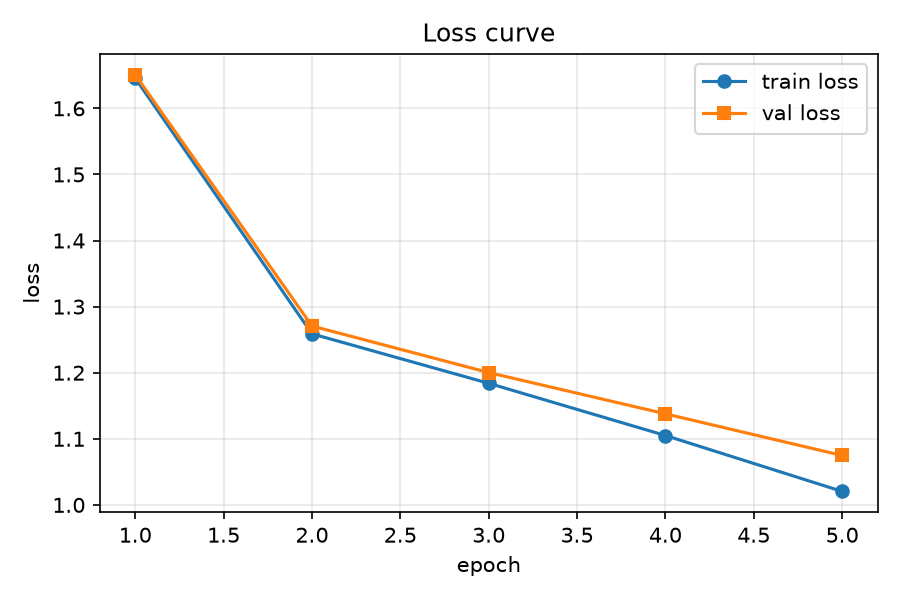
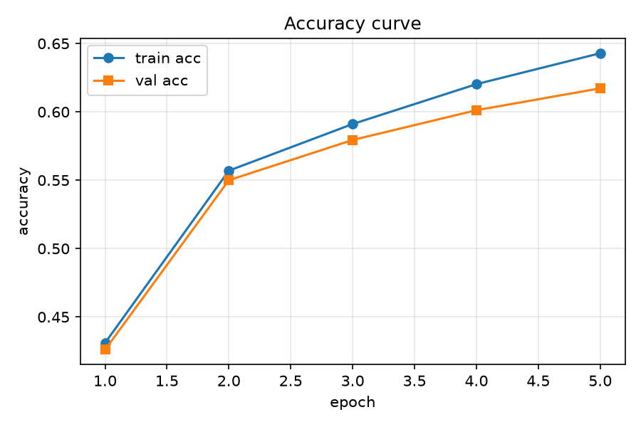

**SGD with Momentum**：

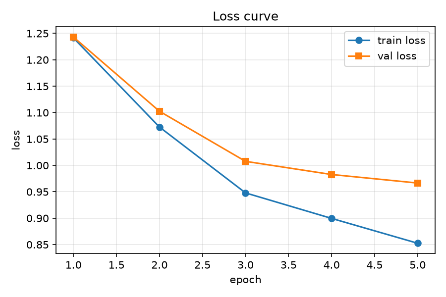
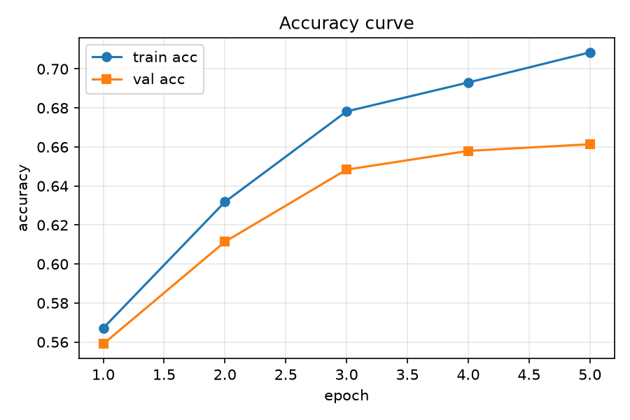

**Adam**：


### 3.4 分析和结论

三种优化器的性能排序为：**Adam（68.69%）> 动量 SGD（65.67%）> 普通 SGD（60.91%）**。

- **SGD**：初始收敛较慢，第 1 个 epoch 后训练准确率仅 43.10%，但全程持续改善，
  暂未出现明显震荡。其中 `ship`（88.90%）和 `frog`（85.00%）分类效果最好，
  `dog`（42.50%）、`deer`（44.10%）和 `airplane`（44.90%）相对较弱。
- **动量 SGD**：验证准确率从 55.90% 持续提升到 66.14%，优于普通 SGD，表明动量项
  加速了收敛并改善了最终性能。`frog`（89.30%）表现最好，`cat`（42.90%）和
  `deer`（37.90%）较弱。
- **Adam**：测试准确率最高（68.69%），训练损失下降最明显（最终 0.7394），验证
  准确率达到 68.76%，是三种优化器中综合表现最优的。`frog`（84.60%）最好，
  `cat`（50.50%）和 `deer`（51.00%）相对较弱。

结论：优化器选择对收敛速度和最终性能影响显著。Adam 的自适应学习率在本实验中
表现最佳，普通 SGD 即使使用较大学习率仍然收敛最慢、准确率最低。

## 4. 对照实验二：网络深度/宽度

固定优化器为 Adam、学习率为 `1e-3`、batch size 和随机种子，在 baseline 基础
上分别改变 block 数和基础通道数，完成深度与宽度两种容量对比。每个配置运行
1 次，并记录总训练时间。

### 4.1 命令

```powershell
uv run python train_cifar10.py --epochs 5 --optimizer adam --lr 1e-3 --num-blocks 3 --base-filters 32 --batch-size 128 --num-val 5000 --seed 0 --out-dir outputs/depth_3blocks

uv run python train_cifar10.py --epochs 5 --optimizer adam --lr 1e-3 --num-blocks 2 --base-filters 48 --batch-size 128 --num-val 5000 --seed 0 --out-dir outputs/width_48
```

### 4.2 结果

#### 4.2.1 汇总对比

| model | num blocks | base filters | best val acc | test acc | time |
|---|---:|---:|---:|---:|---:|
| baseline | 2 | 32 | 68.98% | 68.69% | 7111.18 s（118.52 min） |
| deeper | 3 | 32 | 71.54% | 71.03% | 18776.81 s（312.95 min） |
| wider | 2 | 48 | 70.46% | 69.60% | 14064.98 s（234.42 min） |

#### 4.2.2 Deeper 模型（3 blocks, 32 base filters）

| epoch | train loss | val loss | train acc | val acc |
|---:|---:|---:|---:|---:|
| 1 | 1.1299 | 1.1481 | 59.84% | 59.12% |
| 2 | 0.8989 | 0.9612 | 69.15% | 66.66% |
| 3 | 0.7617 | 0.8712 | 74.12% | 70.06% |
| 4 | 0.6828 | 0.8307 | 76.76% | 71.32% |
| 5 | 0.6223 | 0.8220 | 78.82% | 71.54% |

测试集 loss 为 `0.8446`，测试准确率为 **71.03%**。

逐类准确率如下：

| class | accuracy |
|---|---:|
| airplane | 80.10% |
| automobile | 80.30% |
| bird | 63.50% |
| cat | 39.00% |
| deer | 56.00% |
| dog | 61.60% |
| frog | 88.70% |
| horse | 71.20% |
| ship | 87.60% |
| truck | 82.30% |

#### 4.2.3 Wider 模型（2 blocks, 48 base filters）

| epoch | train loss | val loss | train acc | val acc |
|---:|---:|---:|---:|---:|
| 1 | 1.0987 | 1.1227 | 61.84% | 60.58% |
| 2 | 0.8927 | 0.9687 | 69.77% | 66.36% |
| 3 | 0.7857 | 0.9133 | 73.34% | 68.68% |
| 4 | 0.7024 | 0.8701 | 76.04% | 69.90% |
| 5 | 0.6558 | 0.8630 | 77.98% | 70.46% |

测试集 loss 为 `0.8842`，测试准确率为 **69.60%**。

逐类准确率如下：

| class | accuracy |
|---|---:|
| airplane | 80.50% |
| automobile | 80.40% |
| bird | 60.20% |
| cat | 45.00% |
| deer | 50.80% |
| dog | 68.70% |
| frog | 86.90% |
| horse | 66.90% |
| ship | 76.30% |
| truck | 80.30% |

### 4.3 曲线

**Deeper 模型**：

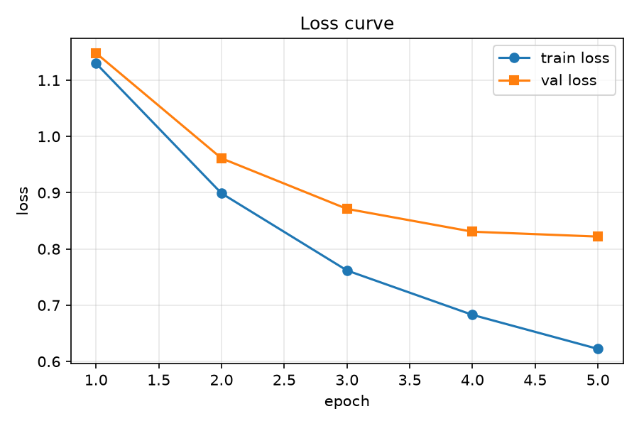
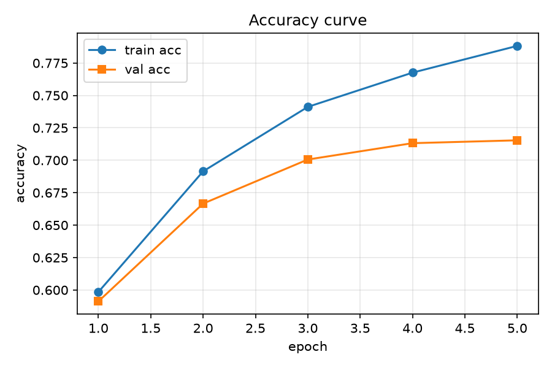

**Wider 模型**：

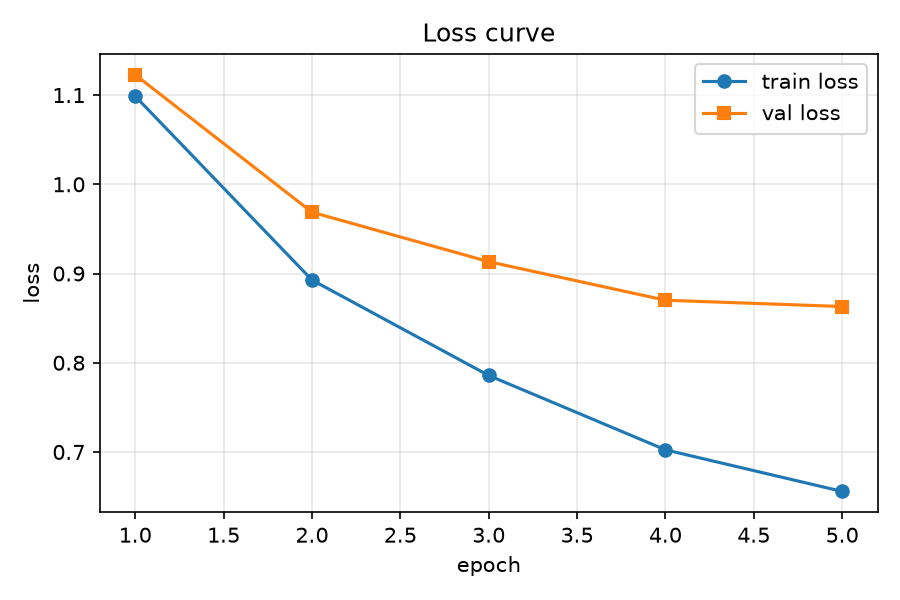
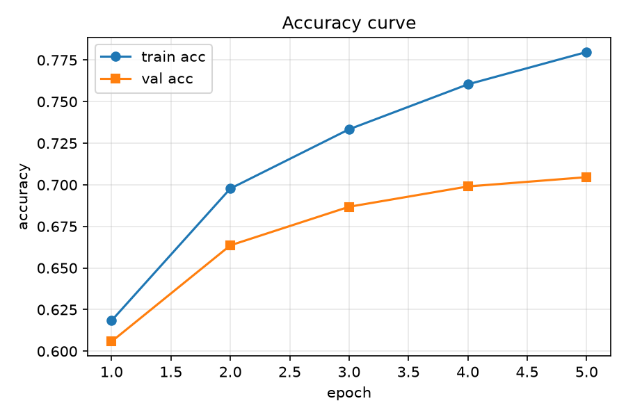

### 4.4 分析和结论

- **Deeper 模型**：与 baseline（2 blocks）相比，测试准确率提高 **2.34** 个百分点
  （71.03% vs 68.69%），最佳验证准确率提高 **2.56** 个百分点（71.54% vs 68.98%）。
  但训练时间从 118.52 分钟增加到 312.95 分钟，约为 baseline 的 2.64 倍。
- **Wider 模型**：与 baseline 相比，测试准确率提高 **0.91** 个百分点（69.60% vs
  68.69%），最佳验证准确率提高 **1.48** 个百分点（70.46% vs 68.98%）。训练时间
  从 118.52 分钟增加到 234.42 分钟，约为 baseline 的 1.98 倍。

两种方式均能提升模型性能，但增加深度（deeper）比增加宽度（wider）的提升效果
更明显，同时训练时间开销也更大。cat 在 deeper 模型中准确率降至 39.00%，可能是
因为模型容量增大后对该类别的过拟合更严重。总体而言，增加网络深度在本实验中是
更有效的容量扩展方式，但需要综合考虑准确率提升与计算成本的权衡。

## 5. 对照实验三：输入预处理

保持模型、优化器和其他训练参数不变，根据 `train_cifar10.py` 中的注释切换预处理
代码。本组比较以下三种预处理方式各 1 次，每次只启用一种方式：

1. **减均值（默认，方式 A）**：启用 `mean_img = X_tr.mean(axis=0)`，并将同一组
   训练集均值分别从训练、验证和测试数据中减去。
2. **按通道标准化（方式 B）**：启用按通道计算的均值和标准差代码，并使用同一组
   训练集统计量处理训练、验证和测试数据。
3. **仅缩放到 `[0, 1]`（方式 C）**：注释掉前两种预处理代码。由于 `load_cifar10`
   内部已经执行 `/255.0`，此时数据保持在 `[0, 1]` 范围内。

### 5.1 命令

方式 A 的减均值结果直接复用第 2 节 baseline 实验，输出目录为
`outputs/baseline_adam`；其余两种方式使用独立的输出目录：

```powershell
uv run python train_cifar10.py --epochs 5 --optimizer adam --lr 1e-3 --num-blocks 2 --base-filters 32 --num-val 5000 --seed 0 --out-dir outputs/preprocess_standard

uv run python train_cifar10.py --epochs 5 --optimizer adam --lr 1e-3 --num-blocks 2 --base-filters 32 --num-val 5000 --seed 0 --out-dir outputs/preprocess_scale
```

### 5.2 结果

#### 5.2.1 汇总对比

| preprocessing | initial loss | epoch-5 train loss | best val acc | test acc |
|---|---:|---:|---:|---:|
| mean subtraction | 1.1642 | 0.7394 | 68.98% | 68.69% |
| channel standardization | 1.1297 | 0.6795 | 68.48% | 68.04% |
| `[0,1]` scaling | 1.1697 | 0.8252 | 66.14% | 67.15% |

#### 5.2.2 按通道标准化（方式 B）

| epoch | train loss | val loss | train acc | val acc |
|---:|---:|---:|---:|---:|
| 1 | 1.1297 | 1.1608 | 61.16% | 58.76% |
| 2 | 0.9234 | 1.0097 | 68.48% | 65.20% |
| 3 | 0.8002 | 0.9389 | 73.04% | 67.42% |
| 4 | 0.7296 | 0.9175 | 75.17% | 68.14% |
| 5 | 0.6795 | 0.9164 | 77.20% | 68.48% |

测试集 loss 为 `0.9455`，测试准确率为 **68.04%**。训练时间为
**8563.63 秒（142.73 分钟）**。

逐类准确率如下：

| class | accuracy |
|---|---:|
| airplane | 76.80% |
| automobile | 79.40% |
| bird | 62.30% |
| cat | 47.10% |
| deer | 55.60% |
| dog | 56.70% |
| frog | 83.00% |
| horse | 63.70% |
| ship | 80.00% |
| truck | 75.80% |

#### 5.2.3 仅缩放到 `[0, 1]`（方式 C）

| epoch | train loss | val loss | train acc | val acc |
|---:|---:|---:|---:|---:|
| 1 | 1.1697 | 1.1840 | 59.96% | 58.64% |
| 2 | 1.0159 | 1.0729 | 65.35% | 62.28% |
| 3 | 0.9152 | 1.0051 | 69.06% | 64.60% |
| 4 | 0.8966 | 1.0039 | 69.58% | 65.48% |
| 5 | 0.8252 | 0.9693 | 71.96% | 66.14% |

测试集 loss 为 `0.9651`，测试准确率为 **67.15%**。训练时间为
**8895.92 秒（148.27 分钟）**。

逐类准确率如下：

| class | accuracy |
|---|---:|
| airplane | 72.70% |
| automobile | 81.00% |
| bird | 63.70% |
| cat | 39.50% |
| deer | 47.10% |
| dog | 64.10% |
| frog | 83.90% |
| horse | 66.40% |
| ship | 75.30% |
| truck | 77.80% |

### 5.3 曲线

**按通道标准化**：

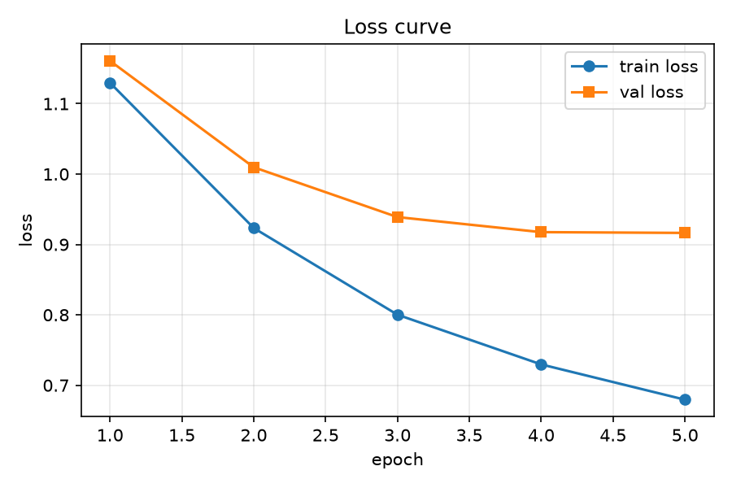
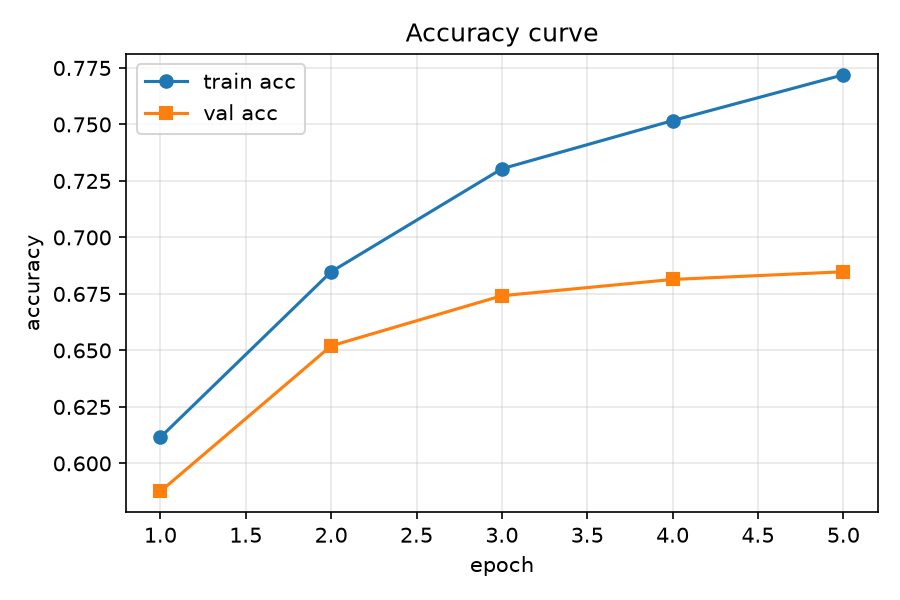

**仅缩放 `[0, 1]`**：

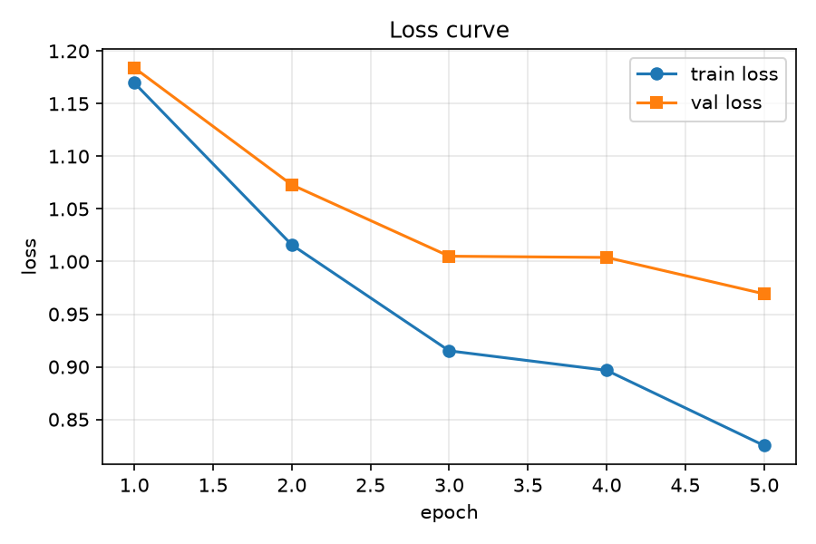
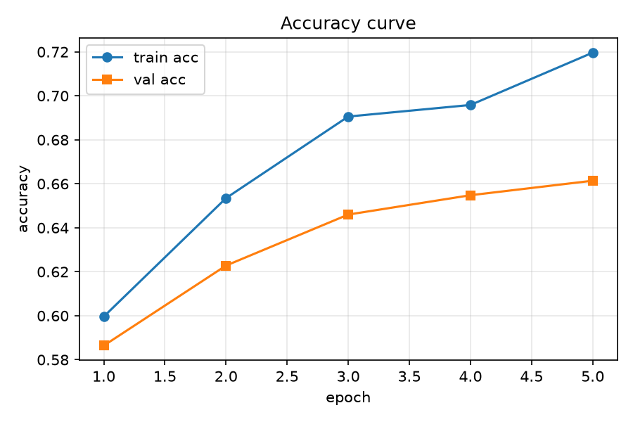

### 5.4 分析和结论

三种预处理方式的性能排序为：**减均值（68.69%）> 按通道标准化（68.04%）>
仅缩放到 `[0, 1]`（67.15%）**。

- **减均值**：初始 loss 为 1.1642，5 个 epoch 后训练 loss 降至 0.7394，测试准确率
  68.69%，是三组中泛化表现最好的。该预处理去除了像素值的整体偏移，使模型能更
  专注于学习相对变化模式。
- **按通道标准化**：初始 loss 最低（1.1297），5 个 epoch 后训练 loss 最低
  （0.6795），但测试准确率（68.04%）比减均值低 0.65 个百分点，说明虽然训练收敛
  更快，但泛化效果略逊于减均值。按通道标准化在本实验中没有表现出优于减均值的
  泛化效果。
- **仅缩放到 `[0, 1]`**：初始 loss 最高（1.1697），5 个 epoch 后训练 loss 最高
  （0.8252），测试准确率（67.15%）比减均值低 1.54 个百分点。该方式保留了像素值
  的绝对差异，缺乏均值中心化使得输入的方差更大，可能导致模型收敛更慢、泛化表现
  相对较弱。

就本次实验结果而言，减均值的整体泛化表现最好。但三种方式之间的差距（最大差值
1.54 个百分点）远小于优化器对比中的差距（7.78 个百分点），说明在该实验设置下
预处理对性能的影响相对有限。

## 6. 预测结果与可视化

**命令**：

```bash
uv run python show_predict_picture.py --predictions outputs/baseline_adam/test_predictions.npz
```

**分析和结论**：程序随机显示 12 张测试图片。结合可视化结果，`frog`、`truck`、
`automobile` 和 `ship` 通常较容易识别；`cat` 经常被误识别为 `dog`，`deer` 则
经常被误识别为 `horse` 或 `frog`。这些混淆可能与 CIFAR-10 图像分辨率较低、动物
姿态变化较大、类别外观相似以及背景干扰有关。

## 7. 思考题

### 7.1 哪些类别预测较好或较差？原因是什么？

正式基线结果中，`frog`、`truck`、`automobile` 和 `ship` 的准确率较高，
其中 `frog` 为 84.60%；`cat` 和 `deer` 较低，分别为 50.50% 和 51.00%。
结合可视化结果，`cat` 经常被识别成 `dog`，`deer` 经常被识别成 `horse` 或
`frog`。这可能是因为青蛙、车辆和船的整体轮廓相对明显，而猫、鹿与其他动物
类别在低分辨率、姿态变化、外观相似和背景干扰下更容易混淆。流程验证结果中
也呈现了相同趋势：`cat` 和 `deer` 是较难识别的类别。

### 7.2 训练准确率上升但验证准确率停滞或下降说明什么？

这通常说明模型开始过拟合训练集，泛化能力没有继续提升。我的实验中**出现了轻微
过拟合**：训练准确率从第 4 个 epoch 的 73.16% 继续上升到第 5 个 epoch 的
75.23%，但验证准确率从 68.98% 小幅下降到 68.76%。后续可以使用最佳验证准确率
对应的 checkpoint（第 4 个 epoch），也可以减少训练 epoch、加入数据增强或正则化，
并进一步调整学习率。

### 7.3 综合三组实验，哪个因素影响最大？

根据三组实验的测试准确率进行比较：

| 因素 | 最好测试 acc | 最差测试 acc | 差值 |
|---|---:|---:|---:|
| 优化器 | 68.69% | 60.91% | 7.78 个百分点 |
| 深度/宽度 | 71.03% | 68.69% | 2.34 个百分点 |
| 预处理 | 68.69% | 67.15% | 1.54 个百分点 |

结论：在本实验设置和随机种子下，影响最大的是**优化器**，因为其测试准确率
变化为 **7.78 个百分点**。Adam 的测试准确率最高（68.69%），普通 SGD
最低（60.91%）；从训练曲线看，Adam 的 loss 下降更快、最终训练 loss 更低，
说明优化器选择对收敛速度和最终性能的影响最明显。

## 8. 最终模型与复现命令

最终提交的 `test_predictions.npz` 位于 baseline 实验的输出目录。下面给出包含
全部参数的复现命令，命令中的 `--out-dir` 与提交的预测文件保持一致。

```powershell
uv run python train_cifar10.py --epochs 5 --optimizer adam --lr 1e-3 --num-blocks 2 --base-filters 32 --batch-size 128 --num-val 5000 --seed 0 --data-root data --out-dir outputs/baseline_adam
```

最终测试准确率：**68.69%**（基线实验，Ubuntu 虚拟机）
流程验证测试准确率：58.13%
流程验证预测文件：`outputs/smock/test_predictions.npz`  
最终预测文件：`outputs/baseline_adam/test_predictions.npz`  
文件包含：`y_true`、`y_pred`、`classes`。